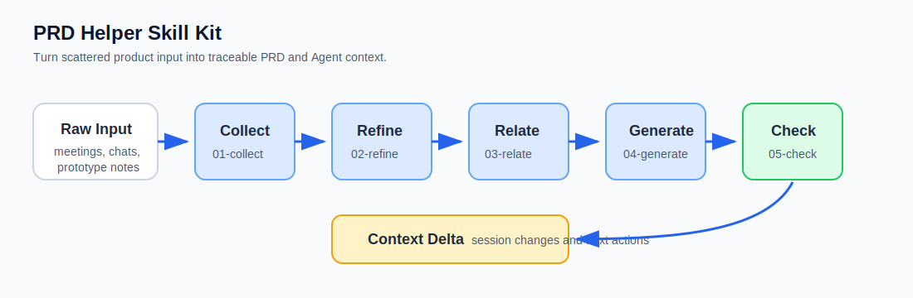

# PRD Helper



## 这是干嘛的

PRD Helper 用来把产品原始材料（会议纪要、聊天记录、原型说明、客户反馈、Agent 对话）整理成可追溯的 PRD 上下文。

入口是根目录 `SKILL.md`，四个业务模块在 `modules/`：

- `modules/collect/`
- `modules/refine/`
- `modules/relate/`
- `modules/generate/`

## 怎么用

1. 把本仓库作为 Skill 放到目标 Agent 的 Skill 目录。
2. 给 Agent 产品材料（会议纪要、原型说明、反馈、对话摘要等）。
3. 产物会输出到目标项目 `docs/prd-helper/`。
4. 用根目录 `scripts/` 做检查：

```bash
python3 scripts/check-structure.py examples/robot-inspection/docs/prd-helper
python3 scripts/check-relations.py examples/robot-inspection/docs/prd-helper
python3 scripts/check-generated.py examples/robot-inspection/docs/prd-helper
```
