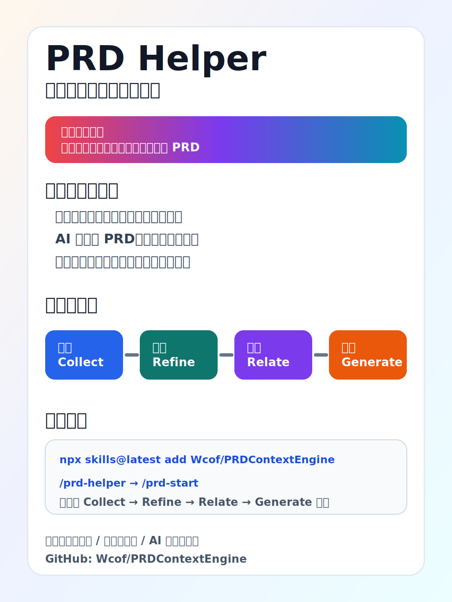

# PRD Helper



## 一句话讲清项目价值

PRD Helper 把分散的产品原始材料沉淀为可追溯、可审计、可复用的 PRD 资产，让团队和 Agent 用同一套流程稳定协作。

## 项目介绍

PRD Helper 是一个单 Skill 的四模块方案，不拆分成多个 skill：

- Collect（采集）：保留原始输入，支持主动采集与被动投放。
- Refine（精炼）：提炼事实、决策、约束、问题与推断。
- Relate（关联）：建立事实到页面、功能、规则、数据、验收的关系。
- Generate（生成）：输出结构化 PRD 与上下文文档供研发与测试复用。

默认文档目录：`docs/prd-helper/`  
Skill 根入口：`SKILL.md`

## 怎么用（当前项目）

1. 安装：

```bash
npx skills@latest add Wcof/PRDContextEngine
```

2. 在 Agent 会话中初始化项目（首次必做）：

```text
/prd-helper
```

3. 初始化后使用采集命令：

```text
/prd-start
/prd-pause
/prd-resume
/prd-stop
/prd-status
/prd-scan
/prd-grill
/prd-remove
```

4. 采集后按模块指南继续推进：

- `modules/refine/guide.md`
- `modules/relate/guide.md`
- `modules/generate/guide.md`

5. 检查示例：

```bash
python3 modules/collect/scripts/check-collect.py --root docs/prd-helper/01-collect
python3 modules/refine/scripts/check-refine.py docs/prd-helper
python3 modules/relate/scripts/check-relate.py docs/prd-helper
python3 modules/generate/scripts/check-generated.py docs/prd-helper
python3 scripts/check-structure.py docs/prd-helper
```
