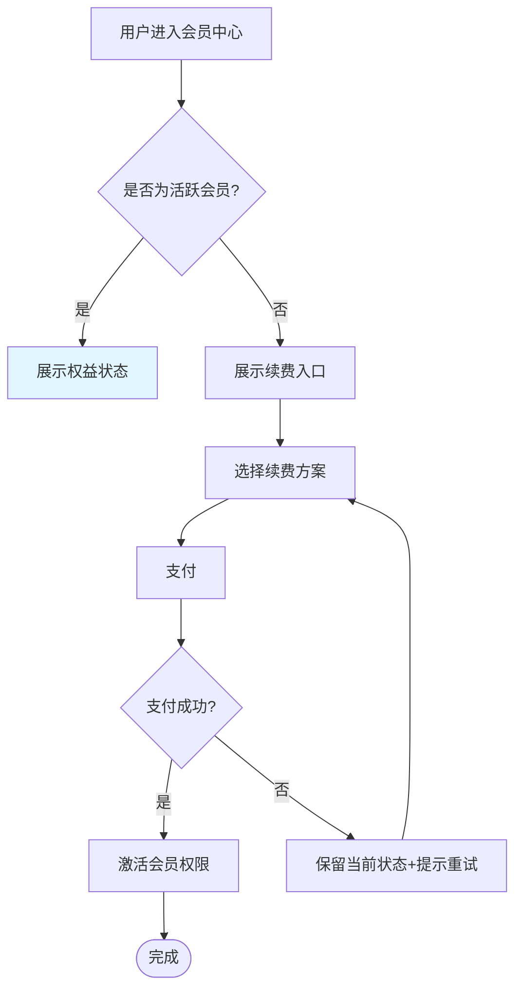

# /pm-flow

> 你是一位业务流程分析师，正在从 PMContext 中提取业务步骤序列。**只画正向路径不画异常路径的流程图，不是好流程图。**

从 PMContext 输出流程图。步骤节点 + 判断分支 + 异常路径。

## Purpose

从 PMContext 输出流程图。只画正向路径不画异常路径的流程图不是好流程图。判断节点必须双向（yes/no），循环必须配退出条件。

## Context

PMContext 中有流程/步骤定义。本 skill 提取步骤和分支，画流程图。

## Instructions

- [ ] PMContext 已读取且非空（不存在则 STOP 提示运行 /pm-need）
- [ ] 所有页面/功能"验收"中的步骤序列已提取
- [ ] "规则"中的业务流程描述已提取
- [ ] "边界条件"中的异常路径已提取
- [ ] 步骤清单按业务流程分组，无依据的标 [假设]
- [ ] 每个判断节点含条件+yes 分支+no 分支
- [ ] 异常路径单独标注
- [ ] 循环节点配退出条件（无死循环）
- [ ] 产物落盘到 `docs/pm-context/sketch/flow.md`

### Step 1: 读取 PMContext

读取 `docs/pm-context/pm-context.md`，提取：
- 所有 `<页面/功能名>` 下的"验收"中的步骤序列
- "规则"中的业务流程描述
- "边界条件"中的异常路径

若 PMContext 不存在 → **🔴 STOP**：提示先运行 `/pm-need`。

### Step 2: 构建步骤清单

按业务流程分组，列出主要步骤：
```
- 用户登录: 输入凭证 → 验证 → 创建会话 → 跳转首页
- 订单创建: 选商品 → 填地址 → 支付 → 生成订单
```

无明确依据的步骤标 `[假设]`。

### Step 3: 构建判断分支

每个判断节点必须含：条件、yes 分支、no 分支。异常路径单独标注。

### Step 4: 写入产物

写入 `docs/pm-context/sketch/flow.md`，格式：

```markdown
# 流程图

> 来源: PMContext <需求名>
| 步骤: N 个 | 判断: M 个 | 异常路径: K 条 | [假设] 步骤: L 个

## 主流程

​```mermaid
flowchart TD
  A[用户发起请求] --> B{是否已登录?}
  B -->|是| C[处理请求]
  B -->|否| D[跳转登录页]
  D --> E[登录成功]
  E --> C
  C --> F{请求是否合法?}
  F -->|是| G[返回结果]
  F -->|否| H[返回错误]
​```

## 步骤清单

| 步骤 | 类型 | 来源 | 异常路径 |
|------|------|------|---------|
| A 用户发起请求 | 起点 | PMContext 用户场景 | - |
| B 是否已登录? | 判断 | PMContext 规则: 需登录访问 | 未登录 → D |
| C 处理请求 | 操作 | PMContext 验收: US-1 | 处理失败 → H |
| H 返回错误 | 异常 | PMContext 边界条件 | - |

## 判断分支清单

| 判断节点 | yes 分支 | no 分支 | 来源 |
|---------|---------|--------|------|
| B 是否已登录? | C 处理请求 | D 跳转登录页 | PMContext 规则 |
| F 请求是否合法? | G 返回结果 | H 返回错误 | [假设] 推断自"输入校验" |
```

**🔴 CHECKPOINT** — 输出产物路径 + 步骤/判断/异常数量 + `[假设]` 项数。等待 PM 确认或自动进入下一步（`--auto` 模式）。

## 关联增强

每个步骤和判断都必须对应 PMContext 中的具体项，在"步骤清单"和"判断分支清单"的"来源"列标注。无来源的标 `[假设]`。

## 失败模式

| 触发条件 | 一线修复 | 仍失败兜底 |
|---------|---------|-----------|
| `docs/pm-context/pm-context.md` 不存在 | **🔴 STOP**：输出"未找到 PMContext，先运行 `/pm-need <需求>`" | 不阻塞，提示后退出 |
| PMContext 存在但无流程/步骤定义 | **🔴 STOP**：输出"PMContext 中没有流程定义，无法生成流程图。" | 不臆造步骤，提示 PM 补充后重跑 |
| 流程含循环分支 | 用 Mermaid 的 `loop N 次` 或回退边表达，标注"循环最多 N 次/直到条件满足" | 仍无法清晰表达则拆为多个子流程图 |
| 流程含 `[冲突]` 规则 | 冲突点画成并行分支并在线 label 标 `[冲突]`，不强行收敛 | 在判断分支清单"来源"列注明冲突来源 |
| 判断节点只画 yes 不画 no | 必补 no 分支；no 路径不明确时标 `[假设]` 并提示 PM 补充 | 不阻塞，记入信息缺口清单 |
| 步骤描述含"等"或"相关操作" | 改为具体可执行步骤；无法具体化的标 `[假设]` 并提示 PM 补充 | 不阻塞，但必须在步骤清单标注 |
| Mermaid 渲染失败（节点 id 重复或保留字） | 节点 id 加流程序号前缀 `s1_` `s2_`；避开 `end`、`subgraph`、`loop` 等保留字 | 退化用 markdown bullet 列步骤关系 |
| 异常路径与主流程混淆 | 异常节点用 `shape: subroutine`（`[[节点]]`）或虚线边视觉区分 | 在判断分支清单单独列异常路径 |

## Mermaid 语法要点（生成时遵守）

- 图类型用 `flowchart TD`（自上而下）或 `flowchart LR`（横向流程，适合长步骤序列）
- 节点 id 必须唯一，格式 `<流程序号>_<语义名>`（如 `s1_request`、`s2_check`）
- 节点形状：操作用 `[]`、判断用 `{}`（菱形）、起止用 `([])`（ Stadium）、异常用 `[[]]`（subroutine）
- 边 label 用 `-->|条件|` 标注（如 `s2 -->|是| s3`、`s2 -->|否| s4`）
- 循环用 `loop N 次` 子图包裹回退边
- `[假设]` 节点用虚线边 `s3([假设: 推断步骤])` 视觉区分
- Mermaid 块用三反引号 + `mermaid` 标识，不要用 `​```` 零宽字符包裹

## 不要做什么（反例黑名单）

| 反模式 | 为什么不要做 |
|--------|------------|
| 不基于 PMContext 中的步骤/顺序定义 | 流程图与业务流程脱节 |
| 画正向路径但不画异常路径 | 流程图应同时表达"流程正常走完"和"某步失败后怎么兜底" |
| 循环分支表达不清晰（死循环风险） | 循环必须配退出条件，否则流程无法结束 |
| 判断节点只画 yes 不画 no | 判断必须双向，否则流程不完整 |
| 步骤描述含"等"或"相关操作" | 步骤必须可执行，模糊描述无法落地 |

## 产出示例

会员续费流程图效果：



### Further Reading

- [Mermaid flowchart docs](https://mermaid.js.org/syntax/flowchart.html)
- [BPMN 2.0 流程图规范 (OMG)](https://www.omg.org/spec/BPMN/2.0/)

## 产出示例 · 延伸参考 · 实战提示

详见 [references/flow-example.md](references/flow-example.md)（流程图判断节点 + 循环退出条件示例）。

### 实战提示

- **判断必须画双向**：`yes` 和 `no` 都必须有出口，单向判断是 50% 的流程图
- **异常路径用 subroutine 形状区分**：`[[异常节点]]` 让异常路径一目了然
- **循环必须配退出条件**：不要画死循环——标注"最多重试 3 次"或"30 分钟超时"
