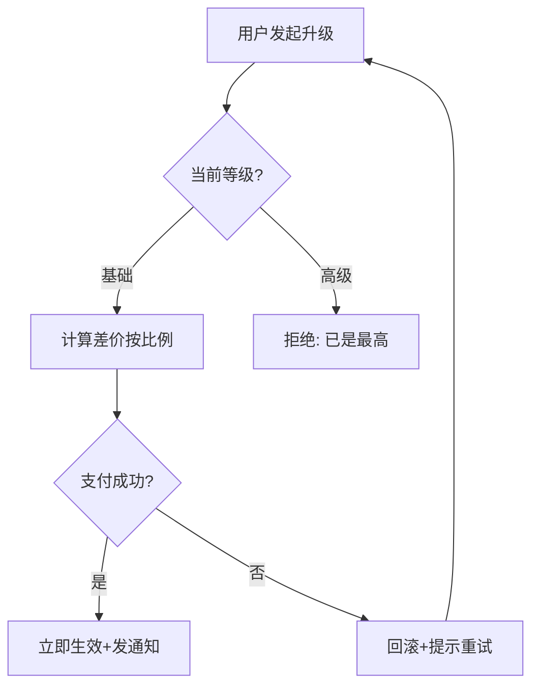

# 产出示例

Mermaid 流程图片段：

# 延伸参考

- [Mermaid flowchart docs](https://mermaid.js.org/syntax/flowchart.html)
- [PM Compass - Process Design](https://www.productcompass.pm/p/what-exactly-is-product-discovery)

# 实战提示

- **判断节点必须双向**：yes/no 都要画，只画正向路径是设计缺陷
- **循环必须配退出条件**：`G -->|重试3次后| H[转人工]`
- **步骤描述含「等」即不可执行**：「等待用户确认」要改为具体触发条件
- **异常路径比正向更重要**：支付失败、超时、取消都要有兜底分支
