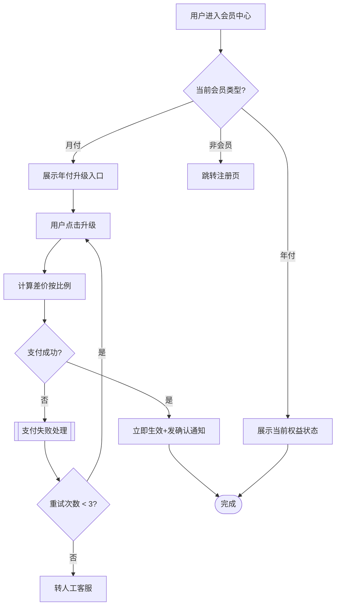

# 流程图产出示例与判断节点技巧

## 完整片段

会员升级流程图：

## 步骤清单

| 步骤 | 类型 | 来源 | 异常路径 |
|------|------|------|---------|
| s1 用户进入会员中心 | 起点 | PMContext 用户场景 | - |
| s2 当前会员类型? | 判断 | PMContext 规则: 需登录访问 | 非会员 → s5 |
| s7 计算差价按比例 | 操作 | PMContext 验收: US-1 | 计算溢出 → 标错误 |
| s8 支付成功? | 判断 | PMContext 规则: 支付网关 | 失败 → s10 |
| s10 支付失败处理 | 异常 | PMContext 边界条件 | - |

## 判断节点技巧

| 技巧 | 说明 |
|------|------|
| **必须双向** | 每个 `{判断}` 必须有 yes 和 no 两个出口，单向判断是 50% 的流程图 |
| **异常路径用 subroutine 形状** | `[[异常节点]]` 让异常路径一目了然 |
| **循环必须配退出条件** | `s11 -->|重试 < 3| s6` 而非死循环，标注"最多重试 3 次" |
| **步骤描述含"等"即不可执行** | "等待用户确认"→"用户点击确认按钮"，"等"=模糊 |
| **异常路径比正向更重要** | 支付失败、超时、取消都要有兜底分支 |

## 延伸参考

- [Mermaid flowchart docs](https://mermaid.js.org/syntax/flowchart.html)
- [BPMN 2.0 流程图规范 (OMG)](https://www.omg.org/spec/BPMN/2.0/)
