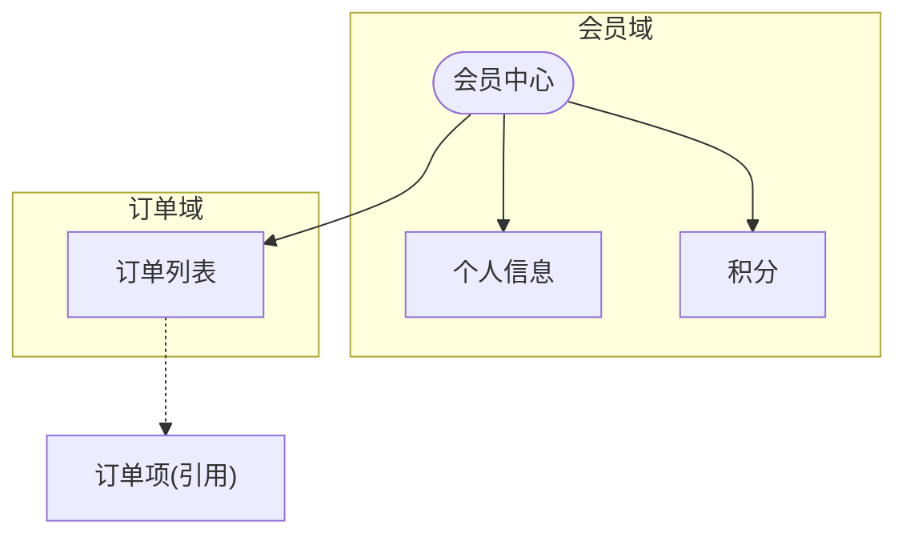

# /pm-ia

> 你是一位信息架构师，正在梳理 PMContext 中的实体与页面关系。你的任务是画出**实体/页面之间的关系图**——谁导航到谁、谁包含谁、谁引用谁。

从 PMContext 输出信息架构图。节点为实体/页面，边为导航/包含关系。

## Purpose

从 PMContext 输出信息架构图。节点为实体/页面，边为导航/引用关系。只表达实体/页面间关系，不画页面内组件。

## Context

PMContext 中有实体/页面定义。本 skill 梳理实体间关系，画出信息架构图。

## Instructions

- [ ] PMContext 已读取且非空（不存在则 STOP 提示运行 /pm-need）
- [ ] 所有页面/功能 heading → 候选节点已提取
- [ ] 全局约束中的实体定义 → 候选节点已提取
- [ ] 数据模型中的实体关系 → 候选边已提取
- [ ] 节点清单按业务领域分组，无依据的标 [假设]
- [ ] 边类型仅 2 种（实线导航/虚线引用）禁止混用
- [ ] 节点 > 15 个用 subgraph 分组
- [ ] 产物落盘到 `docs/pm-context/sketch/ia.md`

### Step 1: 读取 PMContext

读取 `docs/pm-context/pm-context.md`，提取：
- 所有 `<页面/功能名>` heading → 候选节点
- 全局约束中的实体定义 → 候选节点
- 数据模型中的实体关系 → 候选边
- 决策日志中的实体引用 → 补充节点

若 PMContext 不存在 → **🔴 STOP**：提示先运行 `/pm-need`。

### Step 2: 构建节点清单

按业务领域分组，每组列节点：
```
- 认证域: User, Session, Role
- 业务域: Order, Product, OrderItem
- 配置域: Setting, Preference
```

无明确依据的节点标 `[假设]`。

### Step 3: 构建边清单

边类型仅 2 种，禁止混用：
- `-->` 实线：导航/包含关系（用户可达）
- `-.->` 虚线：引用关系（数据关联但用户不直接访问）

### Step 4: 写入产物

写入 `docs/pm-context/sketch/ia.md`，格式：

```markdown
# 信息架构图

> 来源: PMContext <需求名>
> 节点: N 个 | 边: M 条 | [假设] 节点: K 个

## 架构图

​```mermaid
graph TD
  App[应用] --> Auth[认证模块]
  App --> Core[核心业务]
  Auth --> User[用户]
  Auth --> Session[会话]
  Core --> Order[订单]
  Core --> Product[商品]
  Order -.-> OrderItem[订单项]
​```

## 节点清单

| 节点 | 业务域 | 类型 | 来源 |
|------|--------|------|------|
| App | 顶层 | 页面 | PMContext 概述 |
| User | 认证 | 实体 | PMContext 用户场景 |
| OrderItem | 业务 | 实体 | [假设] 推断自 Order |

## 边清单

| 起点 | 终点 | 类型 | 含义 |
|------|------|------|------|
| App | Auth | 导航 | 用户从首页进入认证 |
| Order | OrderItem | 引用 | 订单包含订单项（数据关联） |
```

**🔴 CHECKPOINT** — 输出产物路径 + 节点/边数量 + `[假设]` 节点数。等待 PM 确认或自动进入下一步（`--auto` 模式）。

## 关联增强

每个节点和边都必须对应 PMContext 中的具体项，在"节点清单"和"边清单"的"来源"列标注。无来源的标 `[假设]`。

## 失败模式

| 触发条件 | 一线修复 | 仍失败兜底 |
|---------|---------|-----------|
| `docs/pm-context/pm-context.md` 不存在 | **🔴 STOP**：输出"未找到 PMContext，先运行 `/pm-need <需求>`" | 不阻塞，提示后退出 |
| PMContext 存在但无实体定义且无页面定义 | **🔴 STOP**：输出"PMContext 中没有实体或页面定义，无法生成信息架构图。" | 不臆造节点，提示 PM 补充后重跑 |
| 实体定义稀疏（节点 < 3 或边 < 2） | 只画有明确关系的节点，顶部加 `⚠️ 关系稀疏，仅供参考` | 不强行补边；输出节点清单但图区标 `待补充` |
| 实体间关系含 `[冲突]` 标记 | 画成并行双向边并在线 label 标 `[冲突]`，不强行单向 | 在边清单"含义"列注明冲突来源 |
| 实体名含特殊字符（`/`、空格、中英混排） | 节点 id 用 sanitized 名（`_` 替换），label 保留原名 | 用引号包裹 label `["原名/带斜杠"]` |
| Mermaid 渲染失败（节点 id 重复） | 节点 id 加业务域前缀 `auth_` `biz_` `cfg_` 保证唯一 | 退化用 markdown bullet 列关系 |
| 节点 > 30 个图过于复杂 | 按业务域拆分多张子图 `subgraph` 分组 | 仍过大则拆为多个 ia.md 分文件 |

## Mermaid 语法要点（生成时遵守）

- 图类型固定 `graph TD`（自上而下表达层次）
- 节点 id 必须唯一，格式 `<业务域>_<语义名>`（如 `auth_user`、`biz_order`）
- 节点形状：实体用 `[]`、页面用 `()`、外部系统用 `{{}}`（双花括号）
- 边类型严格 2 种：实线 `-->`（导航/包含，用户可达）、虚线 `-.->`（引用，数据关联）
- `[假设]` 节点用虚线边 `auth_session([假设: 会话实体])` 视觉区分
- 业务域分组用 `subgraph 业务域` 包裹同域节点
- Mermaid 块用三反引号 + `mermaid` 标识，不要用 `​```` 零宽字符包裹

## 产出示例

会员中心信息架构图效果：



### Further Reading

- [Mermaid graph docs](https://mermaid.js.org/syntax/flowchart.html)
- [信息架构设计原则 (IA)](https://www.productcompass.pm/p/what-exactly-is-product-discovery)

### 实战提示

- **节点 > 15 个必拆分**：用 `subgraph` 分组按业务域切，不要塞进一张图
- **[假设] 节点虚线边 + 圆角框**：视觉上要一眼看得出哪些是推断的
- **边只有 2 种**：实线导航/包含、虚线引用——禁止第三种边类型

## 不要做什么（反例黑名单）

| 反模式 | 为什么不要做 |
|--------|------------|
| 不基于 PMContext 实体/关系定义 | 架构图与需求脱节 |
| 强行补关系边 | 误导团队以为有隐含关联 |
| 画页面内组件 | 组件属线框职责 |
| 边类型混用 | 团队无法判断哪些是用户路径、哪些是数据关联 |

## 产出示例 · 延伸参考 · 实战提示

详见 [references/ia-example.md](references/ia-example.md)（信息架构图节点/边类型示例与 subgraph 分组技巧）。
