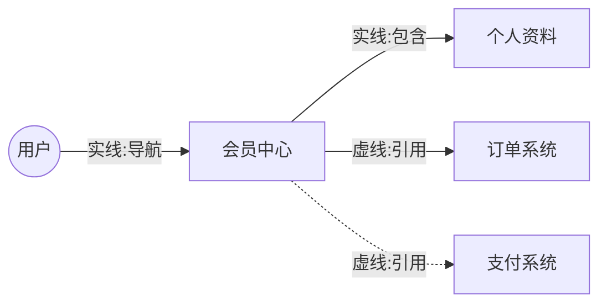

# 产出示例

Mermaid 信息架构图片段：

# 延伸参考

- [Mermaid flowchart docs](https://mermaid.js.org/syntax/flowchart.html)
- [信息架构设计原则 (IA)](https://www.productcompass.pm/p/what-exactly-is-product-discovery)

# 实战提示

- **边只有 2 种**：实线导航/包含、虚线引用——禁止第三种边类型
- **节点 > 15 个必拆分**：用 `subgraph` 按业务域分组，不要塞一张图
- **[假设] 节点虚线边+圆角框**：视觉上一眼区分推断项
- **不画页面内组件**：组件属线框职责，IA 只表达实体/页面间关系
