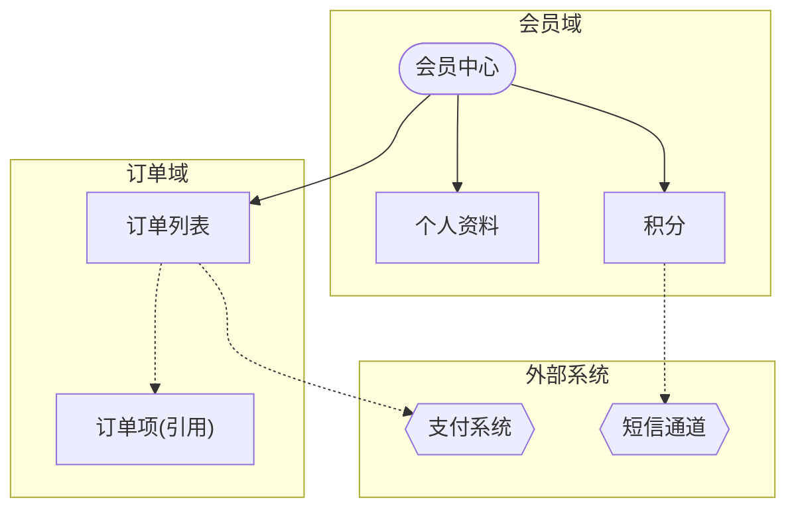
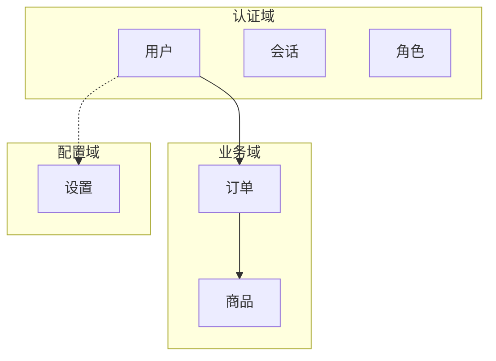

# 信息架构图节点/边类型示例与 subgraph 分组技巧

> 本文件是 `/pm-ia` 的 Level 3 渐进披露资源。展示节点形状、边类型、subgraph 分组的完整用法。

## 输入：PMContext 实体定义（会员中心）

```
## 全局约束
- 实体: User, Membership, Order, OrderItem, Payment, Points
- 关系: User 1-1 Membership, User 1-N Order, Order 1-N OrderItem
## 会员权益（页面）, 订单列表（页面）, 个人资料（页面）
```

## 完整信息架构图



## 节点形状规则

| 形状 | 语法 | 用途 | 示例 |
|------|------|------|------|
| `[]` 方框 | `profile[个人资料]` | 实体 | User, Order |
| `()` 圆角 | `member([会员中心])` | 页面 | 会员中心页 |
| `{{}}` 双花括号 | `pay{{支付系统}}` | 外部系统 | 支付/短信 |
| `([]) Stadium` | `start([开始])` | 起止节点 | 流程入口 |
| 虚线边 | `x([假设: 推断])` | [假设] 节点 | 推断实体 |

## 边类型规则（严格 2 种，禁止第三种）

| 边类型 | 语法 | 含义 | 示例 |
|--------|------|------|------|
| 实线 `-->` | `member --> profile` | 导航/包含（用户可达） | 页面跳转 |
| 虚线 `-.->` | `order -.-> order_item` | 引用（数据关联） | 订单含订单项 |

```
❌ 错误：箭头加文字 label 混用 -->|包含|  当作第三种边
✅ 正确：只有实线/虚线两种，label 仅作说明不改变边类型
```

## subgraph 分组技巧



分组原则：
- 按业务域切，不按技术层切
- 同域节点用 subgraph 包裹，域间用边连接
- 节点 > 15 个必拆分，> 30 个拆为多文件

## 延伸参考

- [Mermaid flowchart docs](https://mermaid.js.org/syntax/flowchart.html)
- [信息架构设计原则 (IA)](https://www.productcompass.pm/p/what-exactly-is-product-discovery)

## 实战提示

- **边只有 2 种**：实线导航/包含、虚线引用——禁止第三种边类型
- **节点 > 15 个必拆分**：用 `subgraph` 按业务域分组，不要塞一张图
- **[假设] 节点虚线边+圆角框**：视觉上一眼区分推断项
- **不画页面内组件**：组件属线框职责，IA 只表达实体/页面间关系
- **节点 id 加业务域前缀**：`auth_user`/`biz_order`/`cfg_setting` 保证唯一
