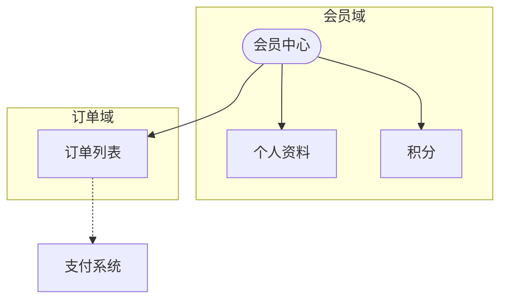
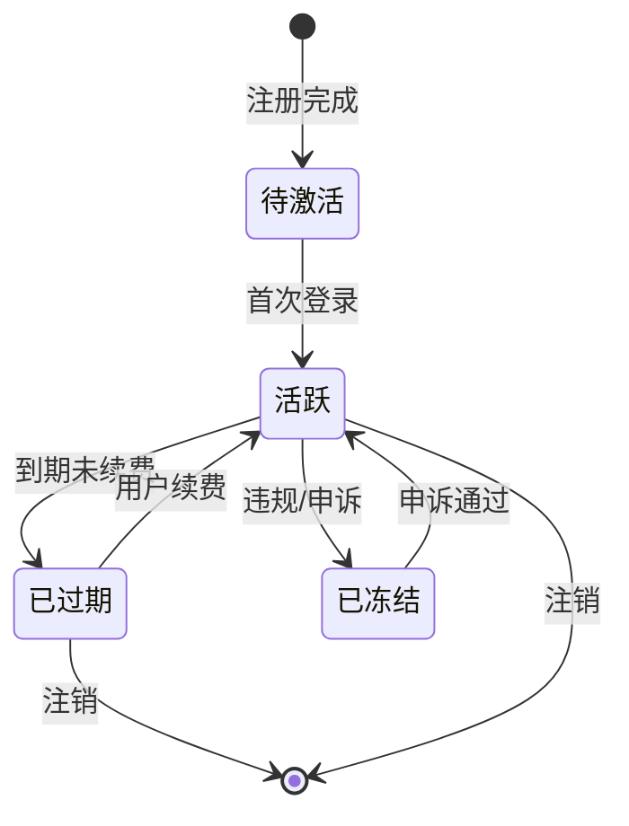

# 草图 + HTML 原型联动产出示例与 9 项质量检查技巧

> 本文件是 `/pm-sketch` 的 Level 3 渐进披露资源。展示从 PMContext 到 4 类草图 + HTML 原型的完整产出。

## 输入：PMContext 片段（会员中心）

```
## 会员中心
### 事实: 手机号验证码登录，登录态保持 7 天
### 规则: 会员三级 标准/高级/至尊
### 验收: 权益变更 24h 内全量同步客户端
## 全局约束: 支付 微信+支付宝，MySQL users_membership
```

## 产出物清单（`--auto --prototype` 模式）

```
docs/pm-context/sketch/
├── ia.md           # 信息架构：会员/订单/积分实体关系
├── state.md        # 状态机：待激活→活跃→已过期→已冻结
├── flow.md         # 续费流程：选方案→支付→激活（含异常路径）
├── wireframe.md    # 线框：3 页布局表格
└── prototype.html  # 高保真交互原型（单页 HTML，无外部依赖）
```

## 信息架构图（ia.md 片段）



## 状态机（state.md 片段）



## HTML 原型骨架（prototype.html 片段）

```html
<section id="member-center">
  <h1>会员中心</h1>
  <table>
    <tr><th>权益</th><th>标准</th><th>高级</th><th>至尊</th></tr>
    <tr><td>广告去除</td><td>✓</td><td>✓</td><td>✓</td></tr>
    <tr><td>高清播放</td><td>-</td><td>✓</td><td>✓</td></tr>
  </table>
  <p class="rule">🔴 权益变更后 24h 内全量同步</p>
  <div class="placeholder">待确认: 线下活动权益</div>
</section>
```

## 9 项质量检查清单

| # | 检查项 | 通过标准 |
|---|--------|---------|
| 1 | 单页 HTML 零外部依赖 | 无 CDN/Tailwind/React |
| 2 | 响应式布局 | 移动 ≤640px / 桌面 ≥1024px |
| 3 | 图元对应 PMContext | 每个组件有来源标注 |
| 4 | [假设] 图元标注 | 灰色占位不伪装确认 |
| 5 | 交互可操作 | 点击/切换/表单 demo 级 |
| 6 | UTF-8 中文正常 | 无乱码 |
| 7 | 文件 < 200KB | 超出精简 |
| 8 | Mermaid 语法正确 | 节点 id 唯一无保留字 |
| 9 | 异常路径齐全 | 状态机含终态，流程含异常 |

## 延伸参考

- [Mermaid stateDiagram-v2 docs](https://mermaid.js.org/syntax/stateDiagram.html)
- [Mermaid flowchart docs](https://mermaid.js.org/syntax/flowchart.html)
- [HTML 原型设计原则](https://www.productcompass.pm/p/the-extended-opportunity-solution-tree)

## 实战提示

- **`--prototype` 优先于 Mermaid 盲出**：HTML 交互原型比 4 张静态图更能暴露 UX 问题
- **质量清单过一遍**：HTML 生成后逐项检查 9 点（断网可预览、[假设] 标注、响应式等）
- **Mermaid 渲染卡顿**：节点 > 30 时拆成子图或分文件，不要硬塞一个图里
- **从 PMContext 到 HTML 映射**：页面→section，事实→table，规则→p.rule，验收→ul.acceptance
