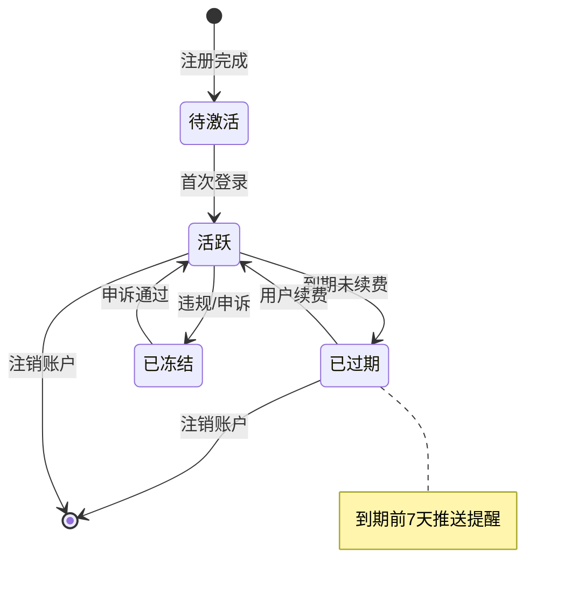

# /pm-state

> 你是一位业务分析师，正在分析 PMContext 中的实体生命周期。**状态机是 PM 最常忽略但工程师最需要的视图**——它暴露了异常路径、非法转移和缺失的终态。

从 PMContext 输出状态机图。状态节点 + 转移边 + 条件标注。

## Purpose

从 PMContext 输出状态机图。状态机最重要的价值是表达异常路径——漏掉失败/超时/取消等异常状态是设计错误。

## Context

PMContext 中有状态/规则定义。本 skill 提取状态和转移，画状态机图。

## Instructions

- [ ] PMContext 已读取且非空（不存在则 STOP 提示运行 /pm-need）
- [ ] 所有页面/功能"规则"中涉及的状态已提取
- [ ] 数据模型中的状态字段已提取
- [ ] 业务流程中的状态转移条件已提取
- [ ] 状态清单按实体分组，无依据的标 [假设]
- [ ] 每条转移含起点+终点+触发条件
- [ ] 异常状态（失败/超时/取消）已覆盖
- [ ] 终态明确（`[*]` 或显式标注无终态设计）
- [ ] 产物落盘到 `docs/pm-context/sketch/state.md`

### Step 1: 读取 PMContext

读取 `docs/pm-context/pm-context.md`，提取：
- 所有 `<页面/功能名>` heading 下的"规则"中涉及的状态
- 数据模型中的状态字段（如 `status: draft|published|archived`）
- 业务流程中的状态转移条件

若 PMContext 不存在 → **🔴 STOP**：提示先运行 `/pm-need`。

### Step 2: 构建状态清单

按实体分组，每个实体列其所有状态：
```
- 订单: draft, submitted, paid, shipped, completed, cancelled
- 用户: guest, registered, verified, banned
```

无明确依据的状态标 `[假设]`。

### Step 3: 构建转移清单

每条转移必须含：起点、终点、触发条件。条件不明确的标 `[假设]`。

### Step 4: 写入产物

写入 `docs/pm-context/sketch/state.md`，格式：

```markdown
# 状态机图

> 来源: PMContext <需求名>
> 实体: N 个 | 状态: M 个 | 转移: K 条 | [假设] 转移: L 条

## 状态机

​```mermaid
stateDiagram-v2
  [*] --> Draft
  Draft --> Submitted: 提交
  Submitted --> InReview: 开始评审
  InReview --> Approved: 通过
  InReview --> Rejected: 驳回
  Rejected --> Draft: 修改后重新提交
  Approved --> [*]
​```

## 状态清单

| 实体 | 状态 | 来源 |
|------|------|------|
| 文档 | Draft | PMContext 规则: 文档初始为草稿 |
| 文档 | Submitted | PMContext 规则: 用户提交后进入 Submitted |
| 文档 | Archived | [假设] 推断自"长期不活动"约束 |

## 转移清单

| 起点 | 终点 | 条件 | 异常路径 | 来源 |
|------|------|------|---------|------|
| Draft | Submitted | 用户点击提交 | 网络失败回 Draft | PMContext 验收: US-3 |
| Submitted | InReview | 评审者打开 | 超时 24h 自动驳回 | [假设] 推断 |
```

**🔴 CHECKPOINT** — 输出产物路径 + 状态/转移数量 + `[假设]` 项数。等待 PM 确认或自动进入下一步（`--auto` 模式）。

## 关联增强

每个状态和转移都必须对应 PMContext 中的具体项，在"状态清单"和"转移清单"的"来源"列标注。无来源的标 `[假设]`。

## 失败模式

| 触发条件 | 一线修复 | 仍失败兜底 |
|---------|---------|-----------|
| `docs/pm-context/pm-context.md` 不存在 | **🔴 STOP**：输出"未找到 PMContext，先运行 `/pm-need <需求>`" | 不阻塞，提示后退出 |
| PMContext 存在但无状态字段且无规则中的状态线索 | **🔴 STOP**：输出"PMContext 中没有状态定义，无法生成状态机图。" | 不臆造状态，提示 PM 补充后重跑 |
| 有实体但无显式状态字段 | 从业务规则中推断隐式状态（如"订单只在已支付后才能发货"→ 隐含"已支付"和"待发货"状态），标 `[假设]` 并附置信度 | 整实体标 `[假设]`，不阻塞 |
| 转移条件含 `[冲突]` | 画成并行双向转移并在线 label 标 `[冲突]`，不强行单向 | 在转移清单"条件"列注明冲突来源 |
| 状态名含特殊字符或中英混排 | 状态 id 用 sanitized 名（`_` 替换空格），label 保留原名 | 用引号包裹 label `["原名/带斜杠"]` |
| Mermaid 渲染失败（状态 id 重复或保留字） | 状态 id 加实体前缀 `order_` `user_`；避开 `state`、`note`、`end` 等保留字 | 退化用 markdown bullet 列转移关系 |
| 状态机无终态 | 补 `[*]` 终止节点；若无自然终态（如用户账号生命周期），在产物顶部标注 `⚠️ 无终态设计：长期运行实体` | 不阻塞，但必须在产物中显式标注 |
| 转移条件写"等"或"等等" | 改为具体可判定条件；无法具体化的标 `[假设]` 并提示 PM 补充 | 不阻塞，记入信息缺口清单 |

## Mermaid 语法要点（生成时遵守）

- 图类型固定 `stateDiagram-v2`（v2 支持 note 和复合状态）
- 状态 id 必须唯一，格式 `<实体>_<状态名>`（如 `order_draft`、`user_verified`）
- 起止节点用 `[*]`（`[*] --> Draft` 表示开始，`Approved --> [*]` 表示终态）
- 转移条件用冒号 `Draft --> Submitted: 用户点击提交`
- `[假设]` 状态用 `state "[假设: 推断状态]" as假设_x` 别名形式视觉区分
- 复合状态用 `state Order { ... }` 包裹同实体的多个状态
- 转移异常路径用 `note right of` 标注（如 `note right of Submitted: 超时 24h 自动驳回`）
- Mermaid 块用三反引号 + `mermaid` 标识，不要用 `​```` 零宽字符包裹

## 不要做什么（反例黑名单）

| 反模式 | 为什么不要做 |
|--------|------------|
| 不基于 PMContext 中的状态/转移定义 | 状态机与业务定义脱节 |
| 推断的状态不标 `[假设]` | 团队误以为这些状态是 PM 确认过的 |
| 漏掉异常状态（失败、超时、取消等） | 状态机最重要的价值是表达异常路径 |
| 转移条件写"等"或"等等" | 条件必须可判定，模糊条件无法实现 |
| 状态机无终态（无 `[*]` 终止） | 流程无法结束的状态机是设计错误 |

## 产出示例

会员状态机效果：



### Further Reading

- [Mermaid stateDiagram-v2 docs](https://mermaid.js.org/syntax/stateDiagram.html)
- [状态机设计模式 (UML)](https://en.wikipedia.org/wiki/UML_state_machine)

## 产出示例 · 延伸参考 · 实战提示

详见 [references/examples-and-tips.md](references/examples-and-tips.md)。

### 实战提示

- **终态不能少**：每个实体必须有明确的终态（`[*]`），否则流程无法结束
- **异常状态优先画**：失败/超时/取消比正常流转更能暴露设计缺陷
- **转移条件必须可判定**：写"条件满足后"不叫条件，写"用户点击确认按钮"才叫条件
