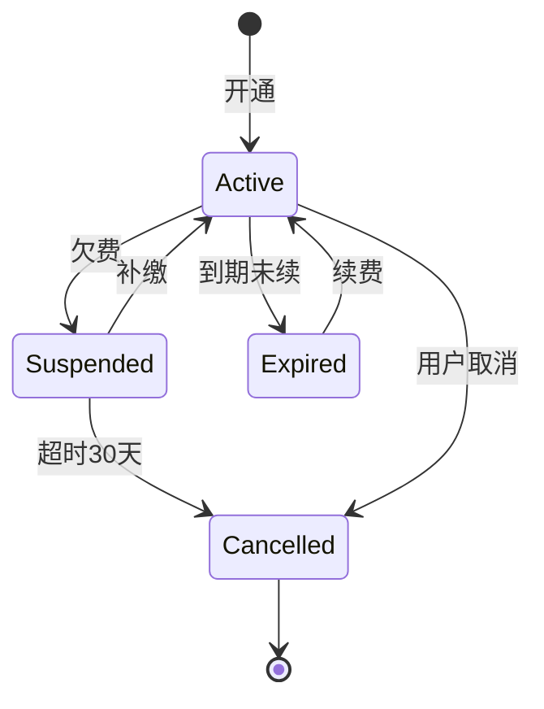

# 产出示例

Mermaid 状态机片段：

# 延伸参考

- [Mermaid stateDiagram-v2 docs](https://mermaid.js.org/syntax/stateDiagram.html)
- [PM Compass - State Design](https://www.productcompass.pm/p/what-exactly-is-product-discovery)

# 实战提示

- **异常路径是核心价值**：漏掉失败/超时/取消等异常状态是设计错误
- **每个状态追溯到 PMContext 规则**：无来源的状态标 [假设] 不伪装为确认
- **必须有终态或显式标注无终态**：`[*]` 或说明「本系统无终态，因 xxx」
- **转移条件要具体**：「欠费」而非「状态变化」，触发条件可执行
