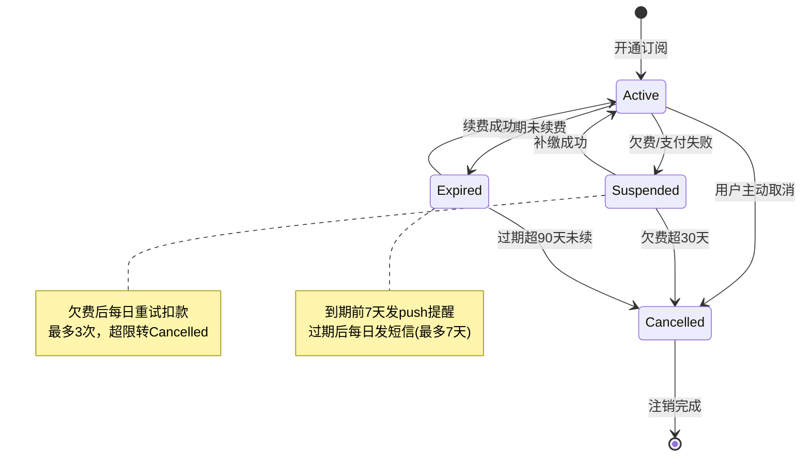

# 状态机图产出示例与异常路径技巧

## 完整片段

会员订阅状态机：

## 状态清单

| 实体 | 状态 | 来源 |
|------|------|------|
| 会员订阅 | Active | PMContext 规则: 开通即为活跃 |
| 会员订阅 | Suspended | PMContext 边界条件: 支付失败 |
| 会员订阅 | Expired | PMContext 规则: 到期未续费 |
| 会员订阅 | Cancelled | PMContext 验收: US-2 |

## 转移清单

| 起点 | 终点 | 条件 | 异常路径 | 来源 |
|------|------|------|---------|------|
| Active | Suspended | 支付失败 | 重试3次仍失败→Cancelled | PMContext 边界条件 |
| Suspended | Active | 补缴成功 | 补缴失败保持Suspended | PMContext 验收: US-1 |
| Active | Expired | 到期未续费 | - | PMContext 规则 |
| Expired | Active | 续费成功 | 续费失败保持Expired | [假设] 推断 |

## 异常路径技巧

| 技巧 | 说明 |
|------|------|
| **异常状态是核心价值** | 漏掉 Suspended/Cancelled 等异常状态是设计错误 |
| **每个状态追溯到 PMContext** | 无来源的状态标 [假设]，不伪装为确认 |
| **必须有终态或显式标注无终态** | `[*]` 或说明「本系统无终态，因 xxx」 |
| **转移条件要具体可判定** | "欠费"而非"状态变化"，"超30天"而非"超时" |
| **note 标注重试策略** | 异常状态的自动恢复逻辑用 note 标注 |

## 延伸参考

- [Mermaid stateDiagram-v2 docs](https://mermaid.js.org/syntax/stateDiagram.html)
- [UML 状态机设计模式](https://en.wikipedia.org/wiki/UML_state_machine)
