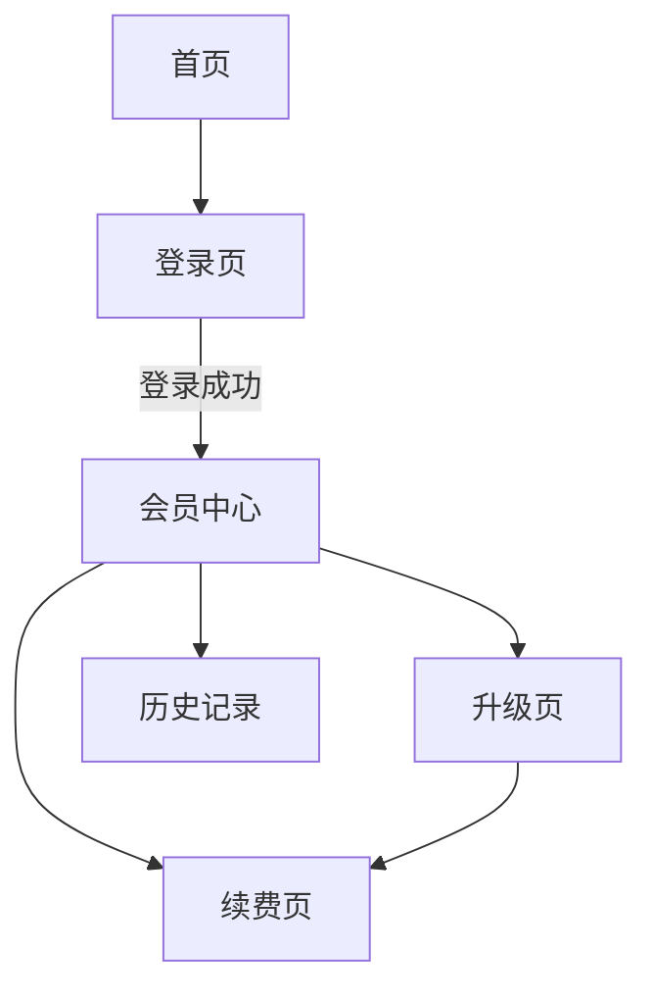

# 线框图产出示例与双维度技巧

## 完整片段

会员中心线框图：

**导航流（Mermaid）**：

**页面内布局（markdown 表格）**：

### 会员中心
| 区域 | 组件 | 数据来源 | 交互 |
|------|------|----------|------|
| 顶部 | 用户头像 + 等级标签 | User API / PMContext 用户场景 | 点击打开设置 |
| 中部 | 当前方案卡片 | MemberPlan API / PMContext 事实 | 展示到期日+自动续费状态 |
| 中部 | 升级入口按钮 | PMContext 规则: 年付可选 | 点击 → 升级页 |
| 底部 | 续费提醒开关 | Setting API / PMContext 规则 | 开/关 push 提醒 |

### 升级页
| 区域 | 组件 | 数据来源 | 交互 |
|------|------|----------|------|
| 顶部 | 方案对比表 | PMContext 事实: 月付 vs 年付价格 | 高亮当前方案 |
| 中部 | 差价金额 | [假设] 推断自剩余天数 | 动态计算 |
| 底部 | 确认升级按钮 | - | 提交 → 支付流程 |

### 续费页
| 区域 | 组件 | 数据来源 | 交互 |
|------|------|----------|------|
| 顶部 | 方案切换 tab | PMContext 规则 | 月付/年付切换 |
| 中部 | 支付方式选择 | PaymentMethod API | 信用卡/余额/其他 |
| 底部 | 确认支付按钮 | - | 提交 → 支付结果 |

## 双维度技巧

| 维度 | 擅长表达 | 工具 |
|------|---------|------|
| **Mermaid 导航图** | 页面间跳转关系、条件分支 | flowchart TD/LR |
| **Markdown 表格** | 页面内组件布局、数据来源、交互 | 4 列固定（区域/组件/数据来源/交互） |

| 技巧 | 说明 |
|------|------|
| **图+表互补缺一不可** | 图擅长导航流，表擅长组件布局细节 |
| **每个组件标注数据来源** | 无来源的标 [假设]，不臆造 |
| **每页独立表格** | 多页面合并到一个表格会混淆组件归属 |
| **线框只表现交互和布局** | 不表达技术实现，那是 ai-prd 的职责 |
| **[假设] 组件用虚线边** | Mermaid 中 `p3([假设: 数据卡片])` 视觉区分 |

## 延伸参考

- [Mermaid flowchart docs](https://mermaid.js.org/syntax/flowchart.html)
- [线框图设计指南 (NN Group)](https://www.nngroup.com/articles/wireflows/)
